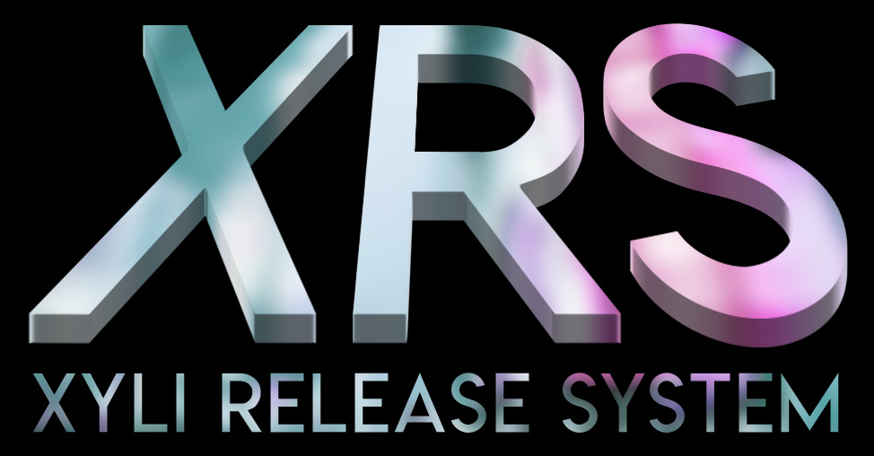

Xylitol Release System (XRS)
============================================

A secure release portal for webscene groups.
First release of it's kind, XRS have been used by RNDD, NoHk, URET, RED, and fews others webscene groups as portal for their respectives releases.
XRS Allow you to maintain and manage a list of all the releases that your group pre.
It is also easilly editable from a code point of view to customize it for your group.

Final version 2.0.0

Features:

    Installer and Uninstaller (easy install, easy  uninstall)
    About Editer (With HTML allowed)
    Anti-Bug System (Write a .log  file if an hacker tried something hostile)
	Token system against csrf when logged in.
    Releases Adder/deletor/editor (Using AJAX technology)
    Search engine (Search a release or an author on your database)
	API for developpers to link your release packer to XRS (beta)
	List with pagination

Requirements for v2:
	MySQL v5.6.5 or superior
	PHP v7.1 or superior
	
Requirements for v1 (use this only if you can't PHP 7, otherwise take XRS v2):
	MySQL v5.1.36 or superior
	PHP v5.3.0 or superior